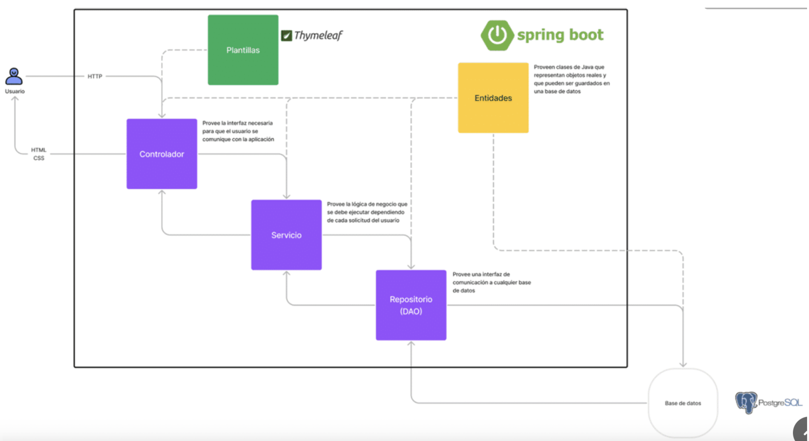

# Ejemplo de SpringBoot

Proyecto para explorar las generalidades de SpringBoot, a través de la creación de una API RESTFull que gestiona Autores y Libros. 

Se persiste en una base de datos de PostgreSQL en la nube [supabase](https://app.supabase.com/sign-in).

Los elementos que se integramn se pueden observar en la siguiente imagen:

## Requisitos previos

- Java 11 o superior.
- Maven 3.6 o superior.
- Conexión a internet para descargar las dependencias.

## Instalación

1. Clonar el repositorio.
2. Desde la terminal, navegar hasta la carpeta del proyecto.
3. Ejecutar el comando `mvn install` para compilar el proyecto y descargar las dependencias.

## Uso

1. Ejecutar el comando `mvn spring-boot:run` desde la carpeta del proyecto.
2. Abrir un navegador y acceder a `http://localhost:8080`.
3. Realizar las acciones que se deseen en la aplicación.

## Contribuciones

1. Hacer un fork del repositorio.
2. Crear una rama nueva con la nueva funcionalidad o corrección de errores.
3. Realizar los cambios necesarios en el código.
4. Ejecutar los tests para asegurarse de que todo sigue funcionando correctamente.
5. Hacer commit de los cambios.
6. Hacer un pull request y esperar la revisión y aprobación de los cambios.

## Créditos

- Jairo Armando Riaño
